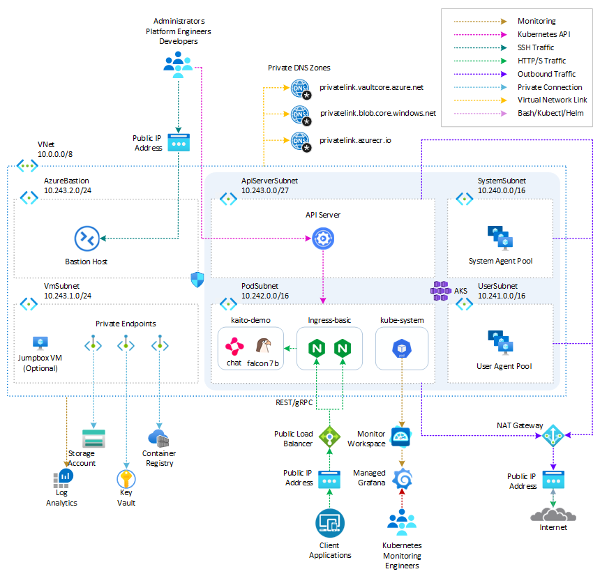

# Deploy Kaito on AKS using Terraform

The [Kubernetes AI toolchain operator (Kaito)](https://learn.microsoft.com/en-us/azure/aks/ai-toolchain-operator) is a Kubernetes operator that simplifies the experience of running OSS AI models like [Falcon](https://huggingface.co/tiiuae) and [Llama2](https://github.com/meta-llama/llama) on your AKS cluster. You can deploy Kaito on your AKS cluster as a managed add-on for[Azure Kubernetes Service (AKS)](https://docs.microsoft.com/en-us/azure/aks/intro-kubernetes). The [Kubernetes AI toolchain operator (Kaito)](https://learn.microsoft.com/en-us/azure/aks/ai-toolchain-operator) uses [Karpenter](https://karpenter.sh/) to automatically provision the necessary GPU nodes based on a specification provided in the Workspace custom resource definition (CRD) and sets up the inference server as an endpoint for your AI models. This add-on reduces onboarding time and allows you to focus on AI model usage and development rather than infrastructure setup.

In this project, I will show you how to:

1. Deploy the Kubernetes AI Toolchain Operator (Kaito) and a Workspace on Azure Kubernetes Service (AKS) using Terraform.
2. Utilize Kaito to create an AKS-hosted inference environment for the [Falcon 7B Instruct model](https://huggingface.co/tiiuae).
3. Develop a chat application using [Python](https://www.python.org/) and [Chainlit](https://docs.chainlit.io/overview) that interacts with the inference endpoint exposed by the AKS-hosted model.

By following this guide, you will be able to easily set up and use the powerful capabilities of Kaito, Python, and Chainlit to enhance your AI model deployment and create dynamic chat applications. For more information on Kaito, see the following resources:

- [Kubernetes AI Toolchain Operator (Kaito)](https://github.com/Azure/Kaito)
- [Deploy an AI model on Azure Kubernetes Service (AKS) with the AI toolchain operator](https://learn.microsoft.com/en-us/azure/aks/ai-toolchain-operator)
- [Intelligent Apps on AKS Ep02: Bring Your Own AI Models to Intelligent Apps on AKS with Kaito](https://learn.microsoft.com/en-us/shows/learn-live/intelligent-apps-on-aks-ep02-bring-your-own-ai-models-to-intelligent-apps-on-aks-with-Kaito)
- [Open Source Models on AKS with Kaito](https://moaw.dev/workshop/?src=gh:pauldotyu/moaw/learnlive/workshops/opensource-models-on-aks-with-Kaito/)

> **NOTE**  
> You can find the `architecture.vsdx` file used for the diagram under the `visio` folder.

## Prerequisites

- An active [Azure subscription](https://docs.microsoft.com/en-us/azure/guides/developer/azure-developer-guide#understanding-accounts-subscriptions-and-billing). If you don't have one, create a [free Azure account](https://azure.microsoft.com/free/) before you begin.
- [Visual Studio Code](https://code.visualstudio.com/) installed on one of the [supported platforms](https://code.visualstudio.com/docs/supporting/requirements#_platforms) along with the [HashiCorp Terraform](https://marketplace.visualstudio.com/items?itemName=HashiCorp.terraform).
- Azure CLI version 2.59.0 or later installed. To install or upgrade, see [Install Azure CLI](https://learn.microsoft.com/en-us/cli/azure/install-azure-cli).
- `aks-preview` Azure CLI extension of version `2.0.0b8` or later installed
- [Terraform v1.7.5 or later](https://developer.hashicorp.com/terraform/downloads).
- The deployment must be started by a user who has sufficient permissions to assign roles, such as a `User Access Administrator` or `Owner`.
- Your Azure account also needs `Microsoft.Resources/deployments/write` permissions at the subscription level.

## Architecture

The following diagram shows the architecture and network topology deployed by the sample:



This project provides a set of Terraform modules to deploy thw following resources:

- [Azure Kubernetes Service](https://registry.terraform.io/providers/hashicorp/azurerm/latest/docs/resources/kubernetes_cluster):  A public or private [Azure Kubernetes Service(AKS)](https://docs.microsoft.com/en-us/azure/aks/intro-kubernetes) cluster composed of a:
  - A `system` node pool in a dedicated subnet. The default node pool hosts only critical system pods and services. The worker nodes have node taint which prevents application pods from beings scheduled on this node pool.
  - A `user` node pool hosting user workloads and artifacts in a dedicated subnet.
- [User-defined Managed Identity](https://registry.terraform.io/providers/hashicorp/azurerm/latest/docs/resources/user_assigned_identity): a user-defined managed identity used by the AKS cluster to create additional resources like load balancers and managed disks in Azure.
- [Azure Virtual Machine](https://registry.terraform.io/providers/hashicorp/azurerm/latest/docs/resources/linux_virtual_machine): Terraform modules can optionally create a jump-box virtual machine to manage the private AKS cluster.
- [Azure Bastion Host](https://registry.terraform.io/providers/hashicorp/azurerm/latest/docs/resources/bastion_host): a separate Azure Bastion is deployed in the AKS cluster virtual network to provide SSH connectivity to both agent nodes and virtual machines.
- [Azure NAT Gateway](https://registry.terraform.io/providers/hashicorp/azurerm/latest/docs/resources/nat_gateway): a bring-your-own (BYO) [Azure NAT Gateway](https://learn.microsoft.com/en-us/azure/virtual-network/nat-gateway/nat-overview) to manage outbound connections initiated by AKS-hosted workloads. The NAT Gateway is associated to the `SystemSubnet`, `UserSubnet`, and `PodSubnet` subnets. The [outboundType](https://learn.microsoft.com/en-us/azure/aks/egress-outboundtype#outbound-type-of-managednatgateway-or-userassignednatgateway) property of the cluster is set to `userAssignedNatGateway` to specify that a BYO NAT Gateway is used for outbound connections. NOTE: you can update the `outboundType` after cluster creation and this will deploy or remove resources as required to put the cluster into the new egress configuration. For more information, see [Updating outboundType after cluster creation](https://learn.microsoft.com/en-us/azure/aks/egress-outboundtype#updating-outboundtype-after-cluster-creation-preview).
- [Azure Storage Account](https://registry.terraform.io/providers/hashicorp/azurerm/latest/docs/resources/storage_account): this storage account is used to store the boot diagnostics logs of both the service provider and service consumer virtual machines. Boot Diagnostics is a debugging feature that allows you to view console output and screenshots to diagnose virtual machine status.
- [Azure Container Registry](https://registry.terraform.io/providers/hashicorp/azurerm/latest/docs/resources/container_registry): an Azure Container Registry (ACR) to build, store, and manage container images and artifacts in a private registry for all container deployments.
- [Azure Key Vault](https://registry.terraform.io/providers/hashicorp/azurerm/latest/docs/resources/key_vault): an Azure Key Vault used to store secrets, certificates, and keys that can be mounted as files by pods using [Azure Key Vault Provider for Secrets Store CSI Driver](https://github.com/Azure/secrets-store-csi-driver-provider-azure). For more information, see [Use the Azure Key Vault Provider for Secrets Store CSI Driver in an AKS cluster](https://learn.microsoft.com/en-us/azure/aks/csi-secrets-store-driver) and [Provide an identity to access the Azure Key Vault Provider for Secrets Store CSI Driver](https://learn.microsoft.com/en-us/azure/aks/csi-secrets-store-identity-access).
- [Azure Private Endpoints](https://registry.terraform.io/providers/hashicorp/azurerm/latest/docs/resources/private_endpoint): an [Azure Private Endpoint](https://docs.microsoft.com/en-us/azure/private-link/private-endpoint-overview) is created for each of the following resources:
  - Azure Container Registry
  - Azure Key Vault
  - Azure Storage Account
  - API Server when deploying a private AKS cluster.
- [Azure Private DNDS Zones](https://registry.terraform.io/providers/hashicorp/azurerm/latest/docs/data-sources/private_dns_zone): an [Azure Private DNS Zone](https://docs.microsoft.com/en-us/azure/dns/private-dns-overview) is created for each of the following resources:
  - Azure Container Registry
  - Azure Key Vault
  - Azure Storage Account
  - API Server when deploying a private AKS cluster.
- [Azure Network Security Group](https://registry.terraform.io/providers/hashicorp/azurerm/latest/docs/data-sources/network_security_group): subnets hosting virtual machines and Azure Bastion Hosts are protected by [Azure Network Security Groups](https://docs.microsoft.com/en-us/azure/virtual-network/network-security-groups-overview) that are used to filter inbound and outbound traffic.
- [Azure Log Analytics Workspace](https://registry.terraform.io/providers/hashicorp/azurerm/latest/docs/resources/log_analytics_workspace): a centralized [Azure Log Analytics](https://docs.microsoft.com/en-us/azure/azure-monitor/logs/log-analytics-workspace-overview) workspace is used to collect the diagnostics logs and metrics from all the Azure resources:
  - Azure Kubernetes Service cluster
  - Azure Key Vault
  - Azure Network Security Group
  - Azure Container Registry
  - Azure Storage Account
  - Azure jump-box virtual machine
- [Azure Monitor workspace](https://registry.terraform.io/providers/hashicorp/azurerm/3.83.0/docs/resources/monitor_workspace): An [Azure Monitor workspace](https://learn.microsoft.com/en-us/azure/azure-monitor/essentials/azure-monitor-workspace-overview) is a unique environment for data collected by [Azure Monitor](https://learn.microsoft.com/en-us/azure/azure-monitor/essentials/data-platform-metrics). Each workspace has its own data repository, configuration, and permissions. Log Analytics workspaces contain logs and metrics data from multiple Azure resources, whereas Azure Monitor workspaces currently contain only metrics related to [Prometheus](https://learn.microsoft.com/en-us/azure/azure-monitor/essentials/prometheus-metrics-overview). Azure Monitor managed service for Prometheus allows you to collect and analyze metrics at scale using a Prometheus-compatible monitoring solution, based on the [Prometheus](https://aka.ms/azureprometheus-promio). This fully managed service allows you to use the [Prometheus query language (PromQL)](https://aka.ms/azureprometheus-promio-promql) to analyze and alert on the performance of monitored infrastructure and workloads without having to operate the underlying infrastructure. The primary method for visualizing Prometheus metrics is [Azure Managed Grafana](https://learn.microsoft.com/en-us/azure/managed-grafana/overview). You can connect your [Azure Monitor workspace](https://learn.microsoft.com/en-us/azure/azure-monitor/essentials/azure-monitor-workspace-overview) to an [Azure Managed Grafana](https://learn.microsoft.com/en-us/azure/managed-grafana/overview) to visualize Prometheus metrics using a set of built-in and custom Grafana dashboards.
- [Azure Managed Grafana](https://registry.terraform.io/providers/hashicorp/azurerm/latest/docs/resources/dashboard_grafana): an [Azure Managed Grafana](https://learn.microsoft.com/en-us/azure/managed-grafana/overview) instance used to visualize the [Prometheus metrics](https://learn.microsoft.com/en-us/azure/azure-monitor/containers/prometheus-metrics-enable?tabs=azure-portal) generated by the [Azure Kubernetes Service(AKS)](https://docs.microsoft.com/en-us/azure/aks/intro-kubernetes) cluster deployed by the Bicep modules. [Azure Managed Grafana](https://learn.microsoft.com/en-us/azure/managed-grafana/overview) is a fully managed service for analytics and monitoring solutions. It's supported by Grafana Enterprise, which provides extensible data visualizations. This managed service allows to quickly and easily deploy Grafana dashboards with built-in high availability and control access with Azure security.
- [NGINX Ingress Controller](https://docs.nginx.com/nginx-ingress-controller/): this sample compares the managed and unmanaged NGINX Ingress Controller. While the managed version is installed using the [Application routing add-on](https://learn.microsoft.com/en-us/azure/aks/app-routing), the unmanaged version is deployed using the [Helm Terraform Provider](https://registry.terraform.io/providers/hashicorp/helm/latest/docs). You can use the Helm provider to deploy software packages in Kubernetes. The provider needs to be configured with the proper credentials before it can be used.
- [Cert-Manager](https://cert-manager.io/docs/): the `cert-manager` package and [Let's Encrypt](https://letsencrypt.org/) certificate authority are used to issue a TLS/SSL certificate to the chat applications.
- [Prometheus](https://prometheus.io/): the AKS cluster is configured to collect metrics to the [Azure Monitor workspace](https://learn.microsoft.com/en-us/azure/azure-monitor/essentials/azure-monitor-workspace-overview) and [Azure Managed Grafana](https://learn.microsoft.com/en-us/azure/managed-grafana/overview). Nonetheless, the [kube-prometheus-stack](https://artifacthub.io/packages/helm/prometheus-community/kube-prometheus-stack) Helm chart is used to install [Prometheus](https://prometheus.io/) and [Grafana](https://grafana.com/) on the AKS cluster.
- Kaito Workspace: a Kaito workspace is used to create a GPU node and the Falcon 7B Instruct model.
- Workload namespace and service account: the [Kubectl Terraform Provider](https://registry.terraform.io/providers/cpanato/kubectl/latest/docs) and [Kubernetes Terraform Provider](https://registry.terraform.io/providers/hashicorp/kubernetes/latest/docs) are used to create the namespace and service account used by the chat applications.
- Azure Monitor ConfigMaps for [Azure Monitor managed service for Prometheus](https://learn.microsoft.com/en-us/azure/azure-monitor/essentials/prometheus-metrics-overview) and `cert-manager` [Cluster Issuer](https://cert-manager.io/docs/configuration/) are deployed using the [Kubectl Terraform Provider](https://registry.terraform.io/providers/cpanato/kubectl/latest/docs) and [Kubernetes Terraform Provider](https://registry.terraform.io/providers/hashicorp/kubernetes/latest/docs).`

The architecture of the `kaito-chat` application can be seen in the image below. The application calls the inference endpoint created by the Kaito workspace for the `Falcon-7B-Instruct` model.


## Kaito

The [Kubernetes AI toolchain operator (Kaito)](https://learn.microsoft.com/en-us/azure/aks/ai-toolchain-operator) is a managed add-on for AKS that simplifies the experience of running OSS AI models on your AKS clusters. The AI toolchain operator automatically provisions the necessary GPU nodes and sets up the associated inference server as an endpoint server to your AI models. Using this add-on reduces your onboarding time and enables you to focus on AI model usage and development rather than infrastructure setup.

### Key Features

1. **Container Image Management**: Kaito allows you to manage large language models using container images. It provides an HTTP server to perform inference calls using the model library.
2. **GPU Hardware Configuration**: Kaito eliminates the need for manual tuning of deployment parameters to fit GPU hardware. It provides preset configurations that are automatically applied based on the model requirements.
3. **Auto-provisioning of GPU Nodes**: Kaito automatically provisions GPU nodes based on the requirements of your models. This ensures that your AI inference workloads have the necessary resources to run efficiently.
4. **Integration with Microsoft Container Registry**: If the license allows, Kaito can host large language model images in the public Microsoft Container Registry (MCR). This simplifies the process of accessing and deploying the models.

### Architecture Overview

Kaito follows the classic Kubernetes Custom Resource Definition (CRD)/controller design pattern. The user manages a workspace custom resource that describes the GPU requirements and the inference specification. Kaito controllers automate the deployment by reconciling the workspace custom resource.


The major components of Kaito include:

1. **Workspace Controller**: This controller reconciles the workspace custom resource, creates machine custom resources to trigger node auto-provisioning, and creates the inference workload (deployment or statefulset) based on the model preset configurations.
2. **Node Provisioner Controller**: This controller, named gpu-provisioner in the [Kaito Helm chart](https://github.com/Azure/Kaito/blob/main/charts/Kaito/gpu-provisioner), interacts with the workspace controller using the machine CRD from [Karpenter](https://github.com/aws/karpenter-core). It integrates with Azure Kubernetes Service (AKS) APIs to add new GPU nodes to the AKS cluster. Note that the gpu-provisioner is an open-source component maintained in the Kaito repository and can be replaced by other controllers supporting Karpenter-core APIs.

Using Kaito greatly simplifies the workflow of onboarding large AI inference models into Kubernetes, allowing you to focus on AI model usage and development without the hassle of infrastructure setup.

### Benefits

There are some significant benefits of running open source LLMs with Kaito. Some advantages include:

- **Automated GPU node provisioning and configuration**: Kaito will automatically provision and configure GPU nodes for you. This can help reduce the operational burden of managing GPU nodes, configuring them for Kubernetes, and tuning model deployment parameters to fit GPU profiles.
- **Reduced cost**: Kaito can help you save money by splitting inferencing across lower end GPU nodes which may also be more readily available and cost less than high-end GPU nodes.
- **Support for popular open-source LLMs**: Kaito offers preset configurations for popular open-source LLMs. This can help you deploy and manage open-source LLMs on AKS and integrate them with your intelligent applications.
- **Fine-grained control**: You can have full control over data security and privacy, model development and configuration transparency, and the ability to fine-tune the model to fit your specific use case.
- **Network and data security**: You can ensure these models are ring-fenced within your organization's network and/or ensure the data never leaves the Kubernetes cluster.

### Models

At the time of this writing, Kaito supports the following models:

#### Llama 2

Meta released [Llama 2](https://ai.meta.com/research/publications/llama-2-open-foundation-and-fine-tuned-chat-models/), a set of pretrained and refined LLMs, along with Llama 2-Chat, a version of Llama 2. These models are scalable up to 70 billion parameters. It was discovered after extensive testing on safety and helpfulness-focused benchmarks that Llama 2-Chat models perform better than current open-source models in most cases. Human evaluations have shown that they align well with several closed-source models. The researchers have even taken a few steps to guarantee the security of these models. This includes annotating data, especially for safety, conducting red-teaming exercises, fine-tuning models with an emphasis on safety issues, and iteratively and continuously reviewing the models. Variants of Llama 2 with 7 billion, 13 billion, and 70 billion parameters have also been released. Llama 2-Chat, optimized for dialogue scenarios, has also been released in variants with the same parameter scales. For more information, see the following resources:

- [Llama 2: Open Foundation and Fine-Tuned Chat Models](https://ai.meta.com/research/publications/llama-2-open-foundation-and-fine-tuned-chat-models/)
- [Llama 2 Project](https://huggingface.co/meta-llama)

#### Falcon

Researchers from Technology Innovation Institute, Abu Dhabi introduced the [Falcon series](https://arxiv.org/pdf/2311.16867.pdf), which includes models with 7 billion, 40 billion, and 180 billion parameters. These models, which are intended to be causal decoder-only models, were trained on a high-quality, varied corpus that was mostly obtained from online data. Falcon-180B, the largest model in the series, is the only publicly available pretraining run ever, having been trained on a dataset of more than 3.5 trillion text tokens.

The researchers discovered that Falcon-180B shows great advancements over other models, including PaLM or Chinchilla. It outperforms models that are being developed concurrently, such as LLaMA 2 or Inflection-1. Falcon-180B achieves performance close to PaLM-2-Large, which is noteworthy given its lower pretraining and inference costs. With this ranking, Falcon-180B joins GPT-4 and PaLM-2-Large as the leading language models in the world. For more information, see the following resources:

- [The Falcon Series of Open Language Models](https://arxiv.org/pdf/2311.16867.pdf)
- [Falcon-40B-Instruct](https://huggingface.co/tiiuae/falcon-40b-instruct)
- [Falcon-180B](https://huggingface.co/tiiuae/falcon-180B)
- [Falcon-7B](https://huggingface.co/tiiuae/falcon-7b)
- [Falcon-7B-Instruct](alcon-7B-Instruct)

#### Mistral

[Mistral 7B v0.1](https://huggingface.co/mistralai/Mistral-7B-v0.1) is a cutting-edge 7-billion-parameter language model that has been developed for remarkable effectiveness and performance. Mistral 7B breaks all previous records, outperforming Llama 2 13B in every benchmark and even Llama 1 34B in crucial domains like logic, math, and coding. 

State-of-the-art methods like grouped-query attention (GQA) have been used to accelerate inference and sliding window attention (SWA) to efficiently handle sequences with different lengths while reducing computing overhead. A customized version, [Mistral 7B — Instruct](https://huggingface.co/mistralai/Mistral-7B-Instruct-v0.2), has also been provided and optimized to perform exceptionally well in activities requiring following instructions. For more information, see the following resources:

- [Mistral-7B-Instruct](https://huggingface.co/mistralai/Mistral-7B-Instruct-v0.2)
- [Mistral-7B](https://huggingface.co/mistralai/Mistral-7B-v0.1)

#### Phi-2

Microsoft introduced [Phi-2](https://huggingface.co/microsoft/phi-2), which is a Transformer model with 2.7 billion parameters. It was trained using a combination of data sources similar to Phi-1.5. It also integrates a new data source, which consists of NLP synthetic texts and filtered websites that are considered instructional and safe. Examining Phi-2 against benchmarks measuring logical thinking, language comprehension, and common sense showed that it performed almost at the state-of-the-art level among models with less than 13 billion parameters. For more information, see the following resources:

- [Phi-2](https://huggingface.co/microsoft/phi-2)

## Chainlit

[Chainlit](https://docs.chainlit.io/overview) is an open-source Python package that is specifically designed to create user interfaces (UIs) for AI applications. It simplifies the process of building interactive chats and interfaces, making developing AI-powered applications faster and more efficient. While Streamlit is a general-purpose UI library, Chainlit is purpose-built for AI applications and seamlessly integrates with other AI technologies such as [LangChain](https://python.langchain.com/docs/get_started/introduction.html), [LlamaIndex](https://gpt-index.readthedocs.io/en/latest/), and [LangFlow](https://github.com/logspace-ai/langflow).

With Chainlit, developers can easily create intuitive UIs for their AI models, including ChatGPT-like applications. It provides a user-friendly interface for users to interact with AI models, enabling conversational experiences and information retrieval. Chainlit also offers unique features, such as the ability to display the [Chain of Thought](https://docs.chainlit.io/concepts/chain-of-thought), which allows users to explore the reasoning process directly within the UI. This feature enhances transparency and enables users to understand how the AI arrives at its responses or recommendations.

For more information, see the following resources:

- [Documentation](https://docs.chainlit.io/overview)
- [Examples](https://docs.chainlit.io/examples/community)
- [API Reference](https://docs.chainlit.io/api-reference/on-message)
- [Cookbook](https://docs.chainlit.io/examples/cookbook)

## Deploy Kaito using Azure CLI

As stated in the [documentation](https://learn.microsoft.com/en-us/azure/aks/ai-toolchain-operator), enabling the Kubernetes AI toolchain operator add-on in AKS creates a managed identity named `ai-toolchain-operator-<aks-cluster-name>`. This managed identity is utilized by the GPU provisioner controller to provision GPU node pools within the managed AKS cluster via [Karpenter](https://karpenter.sh/). To ensure proper functionality, manual configuration of the necessary permissions is required. Follow the steps outlined in the following sections to successfully install Kaito through the AKS add-on.

- Register the AIToolchainOperatorPreview feature flag using the [az feature register](https://learn.microsoft.com/en-us/cli/azure/feature#az_feature_register) command.

   ```bash
   az feature register --namespace "Microsoft.ContainerService" --name "AIToolchainOperatorPreview"
   ```

   It takes a few minutes for the registration to complete.

- Verify the registration using the [az feature show](https://learn.microsoft.com/en-us/cli/azure/feature#az_feature_show) command.

   ```bash
   az feature show --namespace "Microsoft.ContainerService" --name "AIToolchainOperatorPreview"
   ```

- Create an Azure resource group using the [az group create](https://learn.microsoft.com/en-us/cli/azure/group#az_group_create) command.

   ```bash
   az group create --name ${AZURE_RESOURCE_GROUP} --location $AZURE_LOCATION
   ```

- Create an AKS cluster with the AI toolchain operator add-on enabled using the [az aks create](https://learn.microsoft.com/en-us/cli/azure/aks#az_aks_create) command with the `--enable-ai-toolchain-operator` and `--enable-oidc-issuer` flags.

   ```bash
   az aks create --location $AZURE_LOCATION \
       --resource-group $AZURE_RESOURCE_GROUP \
       --name ${CLUSTER_NAME} \
       --enable-oidc-issuer \
       --enable-ai-toolchain-operator
   ```

   AI toolchain operator enablement requires the enablement of OIDC issuer.

- On an existing AKS cluster, you can enable the AI toolchain operator add-on using the [az aks update](https://learn.microsoft.com/en-us/cli/azure/aks#az_aks_update) command as follows:

   ```bash
   az aks update --name ${CLUSTER_NAME} \
           --resource-group ${AZURE_RESOURCE_GROUP} \
           --enable-oidc-issuer \
           --enable-ai-toolchain-operator
   ```

- Configure `kubectl` to connect to your cluster using the [az aks get-credentials](https://learn.microsoft.com/en-us/cli/azure/aks#az_aks_get_credentials) command.

   ```bash
   az aks get-credentials --resource-group $AZURE_RESOURCE_GROUP --name $CLUSTER_NAME
   ```

- Export environment variables for the MC resource group, principal ID identity, and Kaito identity using the following commands:

  ```bash
  export MC_RESOURCE_GROUP=$(az aks show --resource-group $AZURE_RESOURCE_GROUP \
      --name $CLUSTER_NAME \
      --query nodeResourceGroup \
      -o tsv)
  export PRINCIPAL_ID=$(az identity show --name "ai-toolchain-operator-$CLUSTER_NAME" \
      --resource-group $MC_RESOURCE_GROUP \
      --query 'principalId' \
      -o tsv)
  export KAITO_IDENTITY_NAME="ai-toolchain-operator-${CLUSTER_NAME,,}"
  ```

- Get the AKS OIDC Issuer URL and export it as an environment variable:

  ```bash
  export AKS_OIDC_ISSUER=$(az aks show --resource-group "${AZURE_RESOURCE_GROUP}" \
      --name "${CLUSTER_NAME}" \
      --query "oidcIssuerProfile.issuerUrl" \
      -o tsv)
  ```

- Create a new role assignment for the service principal using the [az role assignment create](https://learn.microsoft.com/en-us/cli/azure/role/assignment#az_role_assignment_create) command. The Kaito user-assigned managed identity needs the `Contributor` role on the resource group containing the AKS cluster.

  ```bash
  az role assignment create --role "Contributor" \
      --assignee $PRINCIPAL_ID \
      --scope "/subscriptions/$AZURE_SUBSCRIPTION_ID/resourcegroups/$AZURE_RESOURCE_GROUP"
  ```

- Create a federated identity credential between the KAITO managed identity and the service account used by KAITO controllers using the [az identity federated-credential create](https://learn.microsoft.com/en-us/cli/azure/identity/federated-credential#az_identity_federated_credential_create) command.

  ```bash
  az identity federated-credential create --name "Kaito-federated-identity" \
      --identity-name "${KAITO_IDENTITY_NAME}" \
      -g "${MC_RESOURCE_GROUP}" \
      --issuer "${AKS_OIDC_ISSUER}" \
      --subject system:serviceaccount:"kube-system:Kaito-gpu-provisioner" \
      --audience api://AzureADTokenExchange
  ```

- Verify that the deployment is running using the `kubectl get` command:

  ```bash
  kubectl get deployment -n kube-system | grep Kaito
  ```

- Deploy the `Falcon 7B-instruct` model from the Kaito model repository using the `kubectl apply` command.

   ```azurecli
   kubectl apply -f https://raw.githubusercontent.com/Azure/Kaito/main/examples/Kaito_workspace_falcon_7b-instruct.yaml
   ```

- Track the live resource changes in your workspace using the `kubectl get` command.

   ```azurecli
   kubectl get workspace workspace-falcon-7b-instruct -w
   ```

- Check your service and get the service IP address of the inference endpoint using the `kubectl get svc` command.

   ```azurecli
   export SERVICE_IP=$(kubectl get svc workspace-falcon-7b-instruct -o jsonpath='{.spec.clusterIP}')
   ```

- Run the `Falcon 7B-instruct` model with a sample input of your choice using the following `curl` command:

   ```azurecli
   kubectl run -it --rm -n $namespace --restart=Never curl --image=curlimages/curl -- curl -X POST http://$serviceIp/chat -H "accept: application/json" -H "Content-Type: application/json" -d "{\"prompt\":\"Tell me about Tuscany and its cities.\", \"return_full_text\": false,  \"generate_kwargs\": {\"max_length\":4096}}"
   ```

> **NOTE**  
> As you track the live resource changes in your workspace, the machine readiness can take up to 10 minutes, and workspace readiness up to 20 minutes.

## Deploy Kaito using Terraform

At the time of this writing, the [azurerm_kubernetes_cluster](https://registry.terraform.io/providers/hashicorp/azurerm/latest/docs/resources/kubernetes_cluster) resource in the [AzureRM](https://registry.terraform.io/providers/hashicorp/azurerm/latest) Terraform provider for Azure does not have a property to enable the add-on and install the [Kubernetes AI toolchain operator (Kaito)](https://learn.microsoft.com/en-us/azure/aks/ai-toolchain-operator) on your AKS cluster. However, you can use the [AzAPI Provider](https://registry.terraform.io/providers/Azure/azapi/latest/docs) to deploy Kaito on your AKS cluster. The AzAPI provider is a thin layer on top of the Azure ARM REST APIs. It complements the [AzureRM](https://registry.terraform.io/providers/hashicorp/azurerm/latest/docs) provider by enabling the management of Azure resources that are not yet or may never be supported in the AzureRM provider, such as private/public preview services and features. The following resources replicate the actions performed by the Azure CLI commands mentioned in the previous section.

```terraform
data "azurerm_resource_group" "node_resource_group" {
  count = var.Kaito_enabled ? 1 : 0
  name  = module.aks_cluster.node_resource_group

  depends_on = [module.node_pool]
}

resource "azapi_update_resource" "enable_Kaito" {
  count       = var.Kaito_enabled ? 1 : 0
  type        = "Microsoft.ContainerService/managedClusters@2024-02-02-preview"
  resource_id = module.aks_cluster.id

  body = jsonencode({
    properties = {
      aiToolchainOperatorProfile = {
        enabled = var.Kaito_enabled
      }
    }
  })

  depends_on = [module.node_pool]
}

data "azurerm_user_assigned_identity" "Kaito_identity" {
  count               = var.Kaito_enabled ? 1 : 0
  name                = local.KAITO_IDENTITY_NAME
  resource_group_name = data.azurerm_resource_group.node_resource_group.0.name

  depends_on = [azapi_update_resource.enable_Kaito]
}

resource "azurerm_federated_identity_credential" "Kaito_federated_identity_credential" {
  count               = var.Kaito_enabled ? 1 : 0
  name                = "Kaito-federated-identity"
  resource_group_name = data.azurerm_resource_group.node_resource_group.0.name
  audience            = ["api://AzureADTokenExchange"]
  issuer              = module.aks_cluster.oidc_issuer_url
  parent_id           = data.azurerm_user_assigned_identity.Kaito_identity.0.id
  subject             = "system:serviceaccount:kube-system:Kaito-gpu-provisioner"

  depends_on = [azapi_update_resource.enable_Kaito,
    module.aks_cluster,
  data.azurerm_user_assigned_identity.Kaito_identity]
}

resource "azurerm_role_assignment" "Kaito_identity_contributor_assignment" {
  count                            = var.Kaito_enabled ? 1 : 0
  scope                            = azurerm_resource_group.rg.id
  role_definition_name             = "Contributor"
  principal_id                     = data.azurerm_user_assigned_identity.Kaito_identity.0.principal_id
  skip_service_principal_aad_check = true

  depends_on = [azurerm_federated_identity_credential.Kaito_federated_identity_credential]
}
```

Here is a description of the code above:

- `azurerm_resource_group.node_resource_group`: Retrieves the properties of the node resource group in the current AKS cluster.
- `azapi_update_resource.enable_Kaito`: Enables the Kaito add-on. This operation installs the Kaito operator on the AKS cluster and creates the related user-assigned managed identity in the node resource group.
- `azurerm_user_assigned_identity.Kaito_identity`: Retrieves the properties of the Kaito user-assigned managed identity located in the node resource group.
- `azurerm_federated_identity_credential.Kaito_federated_identity_credential`: Creates the federated identity credential between the Kaito managed identity and the service account used by the Kaito controllers in the `kube-system` namespace, particularly the `Kaito-gpu-provisioner` controller.
- `azurerm_role_assignment.Kaito_identity_contributor_assignment`: Assigns the `Contributor` role to the Kaito managed identity with the AKS resource group as the scope.

## Create the Kaito Workspace via Terraform

To create the Kaito workspace, you can utilize the [kubectl_manifest](https://registry.terraform.io/providers/gavinbunney/kubectl/latest/docs/resources/kubectl_manifest) resource from the [Kubectl Provider](https://registry.terraform.io/providers/gavinbunney/kubectl/latest/docs) in the following manner.

```terraform
resource "kubectl_manifest" "Kaito_workspace" {
  count = var.Kaito_enabled ? 1 : 0

  yaml_body = <<-EOF
    apiVersion: Kaito.sh/v1alpha1
    kind: Workspace
    metadata:
      name: workspace-falcon-7b-instruct
      namespace: ${var.namespace}
      annotations:
        Kaito.sh/enablelb: "False"
    resource:
      count: 1
      instanceType: "${var.instance_type}"
      labelSelector:
        matchLabels:
          apps: falcon-7b-instruct
    inference:
      preset:
        name: "falcon-7b-instruct"
    EOF

  depends_on = [kubectl_manifest.service_account]
}
```

To access the [OpenAPI schema](https://swagger.io/specification/) of the Workspace custom resource definition, execute the following command:

```bash
kubectl get crd workspaces.Kaito.sh -o jsonpath="{.spec.versions[0].schema}" | jq -r
```

Running this command will provide you with the OpenAPI schema for the Workspace custom resource definition in JSON format:

```json
{
  "openAPIV3Schema": {
    "description": "Workspace is the Schema for the workspaces API",
    "properties": {
      "apiVersion": {
        "description": "APIVersion defines the versioned schema of this representation of an object. Servers should convert recognized schemas to the latest internal value, and may reject unrecognized values. More info: https://git.k8s.io/community/contributors/devel/sig-architecture/api-conventions.md#resources",
        "type": "string"
      },
      "inference": {
        "properties": {
          "preset": {
            "description": "Preset describles the model that will be deployed with preset configurations.",
            "properties": {
              "accessMode": {
                "description": "AccessMode specifies whether the containerized model image is accessible via public registry or private registry. This field defaults to \"public\" if not specified. If this field is \"private\", user needs to provide the private image information in PresetOptions.",
                "enum": [
                  "public",
                  "private"
                ],
                "type": "string"
              },
              "name": {
                "description": "Name of the supported models with preset configurations.",
                "type": "string"
              },
              "presetOptions": {
                "properties": {
                  "image": {
                    "description": "Image is the name of the containerized model image.",
                    "type": "string"
                  },
                  "imagePullSecrets": {
                    "description": "ImagePullSecrets is a list of secret names in the same namespace used for pulling the image.",
                    "items": {
                      "type": "string"
                    },
                    "type": "array"
                  }
                },
                "type": "object"
              }
            },
            "required": [
              "name"
            ],
            "type": "object"
          },
          "template": {
            "description": "Template specifies the Pod template used to run the inference service. Users can specify custom Pod settings if the preset configurations cannot meet the requirements. Note that if Preset is specified, Template should not be specified and vice versa.",
            "x-kubernetes-preserve-unknown-fields": true
          }
        },
        "type": "object"
      },
      "kind": {
        "description": "Kind is a string value representing the REST resource this object represents. Servers may infer this from the endpoint the client submits requests to. Cannot be updated. In CamelCase. More info: https://git.k8s.io/community/contributors/devel/sig-architecture/api-conventions.md#types-kinds",
        "type": "string"
      },
      "metadata": {
        "type": "object"
      },
      "resource": {
        "description": "ResourceSpec desicribes the resource requirement of running the workload. If the number of nodes in the cluster that meet the InstanceType and LabelSelector requirements is small than the Count, controller will provision new nodes before deploying the workload. The final list of nodes used to run the workload is presented in workspace Status.",
        "properties": {
          "count": {
            "default": 1,
            "description": "Count is the required number of GPU nodes.",
            "type": "integer"
          },
          "instanceType": {
            "default": "Standard_NC12s_v3",
            "description": "InstanceType specifies the GPU node SKU. This field defaults to \"Standard_NC12s_v3\" if not specified.",
            "type": "string"
          },
          "labelSelector": {
            "description": "LabelSelector specifies the required labels for the GPU nodes.",
            "properties": {
              "matchExpressions": {
                "description": "matchExpressions is a list of label selector requirements. The requirements are ANDed.",
                "items": {
                  "description": "A label selector requirement is a selector that contains values, a key, and an operator that relates the key and values.",
                  "properties": {
                    "key": {
                      "description": "key is the label key that the selector applies to.",
                      "type": "string"
                    },
                    "operator": {
                      "description": "operator represents a key's relationship to a set of values. Valid operators are In, NotIn, Exists and DoesNotExist.",
                      "type": "string"
                    },
                    "values": {
                      "description": "values is an array of string values. If the operator is In or NotIn, the values array must be non-empty. If the operator is Exists or DoesNotExist, the values array must be empty. This array is replaced during a strategic merge patch.",
                      "items": {
                        "type": "string"
                      },
                      "type": "array"
                    }
                  },
                  "required": [
                    "key",
                    "operator"
                  ],
                  "type": "object"
                },
                "type": "array"
              },
              "matchLabels": {
                "additionalProperties": {
                  "type": "string"
                },
                "description": "matchLabels is a map of {key,value} pairs. A single {key,value} in the matchLabels map is equivalent to an element of matchExpressions, whose key field is \"key\", the operator is \"In\", and the values array contains only \"value\". The requirements are ANDed.",
                "type": "object"
              }
            },
            "type": "object",
            "x-kubernetes-map-type": "atomic"
          },
          "preferredNodes": {
            "description": "PreferredNodes is an optional node list specified by the user. If a node in the list does not have the required labels or the required instanceType, it will be ignored.",
            "items": {
              "type": "string"
            },
            "type": "array"
          }
        },
        "required": [
          "labelSelector"
        ],
        "type": "object"
      },
      "status": {
        "description": "WorkspaceStatus defines the observed state of Workspace",
        "properties": {
          "conditions": {
            "description": "Conditions report the current conditions of the workspace.",
            "items": {
              "description": "Condition contains details for one aspect of the current state of this API Resource. --- This struct is intended for direct use as an array at the field path .status.conditions.  For example, \n type FooStatus struct{ // Represents the observations of a foo's current state. // Known .status.conditions.type are: \"Available\", \"Progressing\", and \"Degraded\" // +patchMergeKey=type // +patchStrategy=merge // +listType=map // +listMapKey=type Conditions []metav1.Condition `json:\"conditions,omitempty\" patchStrategy:\"merge\" patchMergeKey:\"type\" protobuf:\"bytes,1,rep,name=conditions\"` \n // other fields }",
              "properties": {
                "lastTransitionTime": {
                  "description": "lastTransitionTime is the last time the condition transitioned from one status to another. This should be when the underlying condition changed.  If that is not known, then using the time when the API field changed is acceptable.",
                  "format": "date-time",
                  "type": "string"
                },
                "message": {
                  "description": "message is a human readable message indicating details about the transition. This may be an empty string.",
                  "maxLength": 32768,
                  "type": "string"
                },
                "observedGeneration": {
                  "description": "observedGeneration represents the .metadata.generation that the condition was set based upon. For instance, if .metadata.generation is currently 12, but the .status.conditions[x].observedGeneration is 9, the condition is out of date with respect to the current state of the instance.",
                  "format": "int64",
                  "minimum": 0,
                  "type": "integer"
                },
                "reason": {
                  "description": "reason contains a programmatic identifier indicating the reason for the condition's last transition. Producers of specific condition types may define expected values and meanings for this field, and whether the values are considered a guaranteed API. The value should be a CamelCase string. This field may not be empty.",
                  "maxLength": 1024,
                  "minLength": 1,
                  "pattern": "^[A-Za-z]([A-Za-z0-9_,:]*[A-Za-z0-9_])?$",
                  "type": "string"
                },
                "status": {
                  "description": "status of the condition, one of True, False, Unknown.",
                  "enum": [
                    "True",
                    "False",
                    "Unknown"
                  ],
                  "type": "string"
                },
                "type": {
                  "description": "type of condition in CamelCase or in foo.example.com/CamelCase. --- Many .condition.type values are consistent across resources like Available, but because arbitrary conditions can be useful (see .node.status.conditions), the ability to deconflict is important. The regex it matches is (dns1123SubdomainFmt/)?(qualifiedNameFmt)",
                  "maxLength": 316,
                  "pattern": "^([a-z0-9]([-a-z0-9]*[a-z0-9])?(\\.[a-z0-9]([-a-z0-9]*[a-z0-9])?)*/)?(([A-Za-z0-9][-A-Za-z0-9_.]*)?[A-Za-z0-9])$",
                  "type": "string"
                }
              },
              "required": [
                "lastTransitionTime",
                "message",
                "reason",
                "status",
                "type"
              ],
              "type": "object"
            },
            "type": "array"
          },
          "workerNodes": {
            "description": "WorkerNodes is the list of nodes chosen to run the workload based on the workspace resource requirement.",
            "items": {
              "type": "string"
            },
            "type": "array"
          }
        },
        "type": "object"
      }
    },
    "type": "object"
  }
}
```

## Kaito Workspace Inference Endpoint

Kaito creates a Kubernetes service with the same name and inside the same namespace of the workspace. This service exposes an inference endpoint that AI applications can use to call the API exposed by the AKS-hosted model. Here is an example of an inference endpoint for a Falcon model from the [Kaito documentation](https://github.com/Azure/kaito/blob/fde6369d760f92c31531e55ea79684084c4dab34/presets/models/falcon/README.md):

```bash
curl -X POST \
    -H "accept: application/json" \
    -H "Content-Type: application/json" \
    -d '{
        "prompt":"YOUR_PROMPT_HERE",
        "return_full_text": false,
        "clean_up_tokenization_spaces": false, 
        "prefix": null,
        "handle_long_generation": null,
        "generate_kwargs": {
                "max_length":200,
                "min_length":0,
                "do_sample":true,
                "early_stopping":false,
                "num_beams":1,
                "num_beam_groups":1,
                "diversity_penalty":0.0,
                "temperature":1.0,
                "top_k":10,
                "top_p":1,
                "typical_p":1,
                "repetition_penalty":1,
                "length_penalty":1,
                "no_repeat_ngram_size":0,
                "encoder_no_repeat_ngram_size":0,
                "bad_words_ids":null,
                "num_return_sequences":1,
                "output_scores":false,
                "return_dict_in_generate":false,
                "forced_bos_token_id":null,
                "forced_eos_token_id":null,
                "remove_invalid_values":null
            }
        }' \
        "http://<SERVICE>:80/chat"
```

Here are the parameters you can use in a call:

- `prompt`: The initial text provided by the user, from which the model will continue generating text.
- `return_full_text`: If False only generated text is returned, else full text is returned.
- `clean_up_tokenization_spaces`: True/False, determines whether to remove potential extra spaces in the text output.
- `prefix`: Prefix added to the prompt.
- `handle_long_generation`: Provides strategies to address generations beyond the model's maximum length capacity.
- `max_length`: The maximum total number of tokens in the generated text.
- `min_length`: The minimum total number of tokens that should be generated.
- `do_sample`: If True, sampling methods will be used for text generation, which can introduce randomness and variation.
- `early_stopping`: If True, the generation will stop early if certain conditions are met, for example, when a satisfactory number of candidates have been found in beam search.
- `num_beams`: The number of beams to be used in beam search. More beams can lead to better results but are more computationally expensive.
- `num_beam_groups`: Divides the number of beams into groups to promote diversity in the generated results.
- `diversity_penalty`: Penalizes the score of tokens that make the current generation too similar to other groups, encouraging diverse outputs.
- `temperature`: Controls the randomness of the output by scaling the logits before sampling.
- `top_k`: Restricts sampling to the k most likely next tokens.
- `top_p`: Uses nucleus sampling to restrict the sampling pool to tokens comprising the top p probability mass.
- `typical_p`: Adjusts the probability distribution to favor tokens that are "typically" likely, given the context.
- `repetition_penalty`: Penalizes tokens that have been generated previously, aiming to reduce repetition.
- `length_penalty`: Modifies scores based on sequence length to encourage shorter or longer outputs.
- `no_repeat_ngram_size`: Prevents the generation of any n-gram more than once.
- `encoder_no_repeat_ngram_size`: Similar to `no_repeat_ngram_size` but applies to the encoder part of encoder-decoder models.
- `bad_words_ids`: A list of token ids that should not be generated.
- `num_return_sequences`: The number of different sequences to generate.
- `output_scores`: Whether to output the prediction scores.
- `return_dict_in_generate`: If True, the method will return a dictionary containing additional information.
- `pad_token_id`: The token ID used for padding sequences to the same length.
- `eos_token_id`: The token ID that signifies the end of a sequence.
- `forced_bos_token_id`: The token ID that is forcibly used as the beginning of a sequence token.
- `forced_eos_token_id`: The token ID that is forcibly used as the end of a sequence when max_length is reached.
- `remove_invalid_values`: If True, filters out invalid values like NaNs or infs from model outputs to prevent crashes.

## Deploy the Terraform modules

Before deploying the Terraform modules in the project, specify a value for the following variables in the [terraform.tfvars](https://developer.hashicorp.com/terraform/language/values/variables#variable-definitions-tfvars-files) variable definitions file.

```terraform
name_prefix                  = "Anubi"
location                     = "westeurope"
domain                       = "babosbird.com"
kubernetes_version           = "1.29.2"
network_plugin               = "azure"
network_plugin_mode          = "overlay"
network_policy               = "azure"
system_node_pool_vm_size     = "Standard_D4ads_v5"
user_node_pool_vm_size       = "Standard_D4ads_v5"
ssh_public_key               = "ssh-rsa XXXXXXXXXXXXXXXXXXXXXXXXXXXXX"
vm_enabled                   = true
admin_group_object_ids       = ["XXXXXXXX-XXXX-XXXX-XXXX-XXXXXXXXXXXX"] 
web_app_routing_enabled      = true
dns_zone_name                = "babosbird.com"
dns_zone_resource_group_name = "DnsResourceGroup"
namespace                    = "Kaito-demo"
service_account_name         = "Kaito-sa"
grafana_admin_user_object_id = "XXXXXXXX-XXXX-XXXX-XXXX-XXXXXXXXXXXX"
vnet_integration_enabled     = true
openai_enabled               = false
Kaito_enabled                = true
instance_type                = "Standard_NC12s_v3"
```

Description:

- `name_prefix`: Specifies a prefix for all the Azure resources.
- `location`: Specifies the region (e.g., westeurope) where deploying the Azure resources.
- `domain`: Specifies the domain part (e.g., subdomain.domain) of the hostname of the ingress object used to expose the chatbot via the [NGINX Ingress Controller](https://docs.nginx.com/nginx-ingress-controller/).
- `kubernetes_version`: Specifies the Kubernetes version installed on the AKS cluster.
- `network_plugin`: Specifies the network plugin of the AKS cluster.
- `network_plugin_mode`: Specifies the network plugin mode used for building the Kubernetes network. Possible value is overlay.
- `network_policy`: Specifies the network policy of the AKS cluster. Currently supported values are calico, azure and cilium.
- `system_node_pool_vm_size`: Specifies the virtual machine size of the system-mode node pool.
- `user_node_pool_vm_size`: Specifies the virtual machine size of the user-mode node pool.
- `ssh_public_key`: Specifies the SSH public key used for the AKS nodes and jumpbox virtual machine.
- `vm_enabled`: a boleean value that specifies whether deploying or not a jumpbox virtual machine in the same virtual network of the AKS cluster.
- `admin_group_object_ids`: when deploying an AKS cluster with Microsoft Entra ID and Azure RBAC integration, this array parameter contains the list of Microsoft Entra ID group object IDs that will have the admin role of the cluster.
- `web_app_routing_enabled`: Specifies whether the [application routing add-on](https://learn.microsoft.com/en-us/azure/aks/app-routing?tabs=default%2Cdeploy-app-default) is enabled. When enabled, this add-on installs a managed instance of the [NGINX Ingress Controller](https://docs.nginx.com/nginx-ingress-controller/) on the AKS cluster.
- `dns_zone_name`: Specifies the name of the Azure Public DNS zone used by the [application routing add-on](https://learn.microsoft.com/en-us/azure/aks/app-routing?tabs=default%2Cdeploy-app-default).
- `dns_zone_resource_group_name`: Specifies the resource group name of the Azure Public DNS zone used by the [application routing add-on](https://learn.microsoft.com/en-us/azure/aks/app-routing?tabs=default%2Cdeploy-app-default).
- `namespace`: Specifies the namespace of the workload application.
- `service_account_name`: Specifies the name of the service account of the workload application.
- `grafana_admin_user_object_id`: Specifies the object id of the Azure Managed Grafana administrator user account.
- `vnet_integration_enabled`: Specifies whether [API Server VNet Integration](https://learn.microsoft.com/en-us/azure/aks/api-server-vnet-integration) is enabled.
- `openai_enabled`: Specifies whether to deploy Azure OpenAI Service or not. This sample does not require the deployment of Azure OpenAI Service.
- `Kaito_enabled`: Specifies whether to deploy the Kubernetes AI Toolchain Operator (Kaito).
- `instance_type`: Specifies the GPU node SKU (e.g. `Standard_NC12s_v3`) to use in the Kaito workspace.

> **NOTE**  
> We suggest reading sensitive configuration data such as passwords or SSH keys from a pre-existing Azure Key Vault resource. For more information, see [Referencing Azure Key Vault secrets in Terraform](https://thomasthornton.cloud/2022/02/26/referencing-azure-key-vault-secrets-in-terraform/). Before proceeding, also make sure to run the `register-preview-features.sh` Bash script in the `terraform` folder to register any preview feature used by the AKS cluster.

## GPU VM-family vCPU quotas

Before installing the Terraform module, make sure to have enough vCPU quotas in the selected region for the GPU VM family specified in the `instance_type` parameter. In case you don't have enough quota, follow the instructions described in [Increase VM-family vCPU quotas](https://learn.microsoft.com/en-us/azure/quotas/per-vm-quota-requests). The steps for requesting a quota increase vary based on whether the quota is adjustable or non-adjustable.

- Adjustable quotas: Quotas for which you can request a quota increase fall into this category. Each subscription has a default quota value for each VM family and region. You can request an increase for an adjustable quota from the [Azure Portal](https://portal.azure.com/#home) `My quotas` page, providing an amount or usage percentage for a given VM family in a specified region and submitting it directly. This is the quickest way to increase quotas.


- Non-adjustable quotas: These are quotas which have a hard limit, usually determined by the scope of the subscription. To make changes, you must submit a support request, and the Azure support team will help provide solutions.

If you don't have enough vCPU quota for the selected instance type, the Kaito workspace creation will fail. You can check the error description using the [Azure Monitor Activity Log](https://learn.microsoft.com/en-us/azure/azure-monitor/essentials/activity-log-insights), as shown in the following figure:


To read the logs of the Kaito GPU provisioner pod in the `kube-system` namespace, you can use the following command.

```bash
kubectl logs -n kube-system $(kubectl get pods -n kube-system | grep Kaito-gpu-provisioner | awk '{print $1; exit}')
```

In case you exceeded the quota for the selected instance type, you could see an error message as follows:

```text
{"level":"INFO","time":"2024-04-04T08:42:40.398Z","logger":"controller","message":"Create","machine":{"name":"ws560b34aa2"}}
{"level":"INFO","time":"2024-04-04T08:42:40.398Z","logger":"controller","message":"Instance.Create","machine":{"name":"ws560b34aa2"}}
{"level":"INFO","time":"2024-04-04T08:42:40.398Z","logger":"controller","message":"createAgentPool","agentpool":"ws560b34aa2"}
{"level":"ERROR","time":"2024-04-04T08:42:48.010Z","logger":"controller","message":"Reconciler error","controller":"machine.lifecycle","controllerGroup":"karpenter.sh","controllerKind":"Machine","Machine":{"name":"ws560b34aa2"},"namespace":"","name":"ws560b34aa2","reconcileID":"b6f56170-ae31-4b05-80a6-019d3f716acc","error":"creating machine, creating instance, agentPool.BeginCreateOrUpdate for \"ws560b34aa2\" failed: PUT https://management.azure.com/subscriptions/1a45a694-af23-4650-9774-89a981c462f6/resourceGroups/AtumRG/providers/Microsoft.ContainerService/managedClusters/AtumAks/agentPools/ws560b34aa2\n--------------------------------------------------------------------------------\nRESPONSE 400: 400 Bad Request\nERROR CODE: PreconditionFailed\n--------------------------------------------------------------------------------\n{\n  \"code\": \"PreconditionFailed\",\n  \"details\": null,\n  \"message\": \"Provisioning of resource(s) for Agent Pool ws560b34aa2 failed. Error: {\\n  \\\"code\\\": \\\"InvalidTemplateDeployment\\\",\\n  \\\"message\\\": \\\"The template deployment '490396b4-1191-4768-a421-3b6eda930287' is not valid according to the validation procedure. The tracking id is '1634a570-53d2-4a7f-af13-5ac157edbb9d'. See inner errors for details.\\\",\\n  \\\"details\\\": [\\n   {\\n    \\\"code\\\": \\\"QuotaExceeded\\\",\\n    \\\"message\\\": \\\"Operation could not be completed as it results in exceeding approved standardNVSv3Family Cores quota. Additional details - Deployment Model: Resource Manager, Location: eastus, Current Limit: 0, Current Usage: 0, Additional Required: 24, (Minimum) New Limit Required: 24. Submit a request for Quota increase at https://aka.ms/ProdportalCRP/#blade/Microsoft_Azure_Capacity/UsageAndQuota.ReactView/Parameters/%7B%22subscriptionId%22:%221a45a694-af23-4650-9774-89a981c462f6%22,%22command%22:%22openQuotaApprovalBlade%22,%22quotas%22:[%7B%22location%22:%22eastus%22,%22providerId%22:%22Microsoft.Compute%22,%22resourceName%22:%22standardNVSv3Family%22,%22quotaRequest%22:%7B%22properties%22:%7B%22limit%22:24,%22unit%22:%22Count%22,%22name%22:%7B%22value%22:%22standardNVSv3Family%22%7D%7D%7D%7D]%7D by specifying parameters listed in the ‘Details’ section for deployment to succeed. Please read more about quota limits at https://docs.microsoft.com/en-us/azure/azure-supportability/per-vm-quota-requests\\\"\\n   }\\n  ]\\n }\",\n  \"subcode\": \"\"\n}\n--------------------------------------------------------------------------------\n"}
```

## Kaito Chat Application

The project provides the code of a chat application using [Python](https://www.python.org/) and [Chainlit](https://docs.chainlit.io/overview) that interacts with the inference endpoint exposed by the AKS-hosted model. As an alternative, the chat application can be configured to call the REST API of an [Azure OpenAI Service](https://learn.microsoft.com/en-us/azure/ai-services/openai/overview). For more information about how to configure the chat application with Azure OpenAI Service, see the following articles:

- Create an Azure OpenAI, LangChain, ChromaDB, and Chainlit chat app in AKS using Terraform ([Azure Samples](https://github.com/Azure-Samples/aks-openai-chainlit-terraform))([My GitHub](https://github.com/paolosalvatori/aks-openai-chainlit-terraform))([Tech Community](https://techcommunity.microsoft.com/t5/fasttrack-for-azure/create-an-azure-openai-langchain-chromadb-and-chainlit-chat-app/ba-p/4024070))
- Deploy an OpenAI, LangChain, ChromaDB, and Chainlit chat app in Azure Container Apps using Terraform ([Azure Samples](https://github.com/Azure-Samples/container-apps-openai))([My GitHub](https://github.com/paolosalvatori/container-apps-openai))([Tech Community](https://techcommunity.microsoft.com/t5/fasttrack-for-azure/deploy-an-openai-langchain-chromadb-and-chainlit-chat-app-in/ba-p/3885602))

This is the code of the sample application.

```python
# Import packages
import os
import sys
import requests
import json
from openai import AsyncAzureOpenAI
import logging
import chainlit as cl
from azure.identity import DefaultAzureCredential, get_bearer_token_provider
from dotenv import load_dotenv
from dotenv import dotenv_values

# Load environment variables from .env file
if os.path.exists(".env"):
    load_dotenv(override=True)
    config = dotenv_values(".env")

# Read environment variables
temperature = float(os.environ.get("TEMPERATURE", 0.9))
top_p = float(os.environ.get("TOP_P", 1))
top_k = float(os.environ.get("TOP_K", 10))
max_length = int(os.environ.get("MAX_LENGTH", 4096))
api_base = os.getenv("AZURE_OPENAI_BASE")
api_key = os.getenv("AZURE_OPENAI_KEY")
api_type = os.environ.get("AZURE_OPENAI_TYPE", "azure")
api_version = os.environ.get("AZURE_OPENAI_VERSION", "2023-12-01-preview")
engine = os.getenv("AZURE_OPENAI_DEPLOYMENT")
model = os.getenv("AZURE_OPENAI_MODEL")
system_content = os.getenv("AZURE_OPENAI_SYSTEM_MESSAGE", "You are a helpful assistant.")
max_retries = int(os.getenv("MAX_RETRIES", 5))
timeout = int(os.getenv("TIMEOUT", 30))
debug = os.getenv("DEBUG", "False").lower() in ("true", "1", "t")
useLocalLLM = os.getenv("USE_LOCAL_LLM", "False").lower() in ("true", "1", "t")
aiEndpoint = os.getenv("AI_ENDPOINT", "")

if not useLocalLLM:
    # Create Token Provider
    token_provider = get_bearer_token_provider(
        DefaultAzureCredential(),
        "https://cognitiveservices.azure.com/.default",
    )

    # Configure OpenAI
    if api_type == "azure":
        openai = AsyncAzureOpenAI(
            api_version=api_version,
            api_key=api_key,
            azure_endpoint=api_base,
            max_retries=max_retries,
            timeout=timeout,
        )
    else:
        openai = AsyncAzureOpenAI(
            api_version=api_version,
            azure_endpoint=api_base,
            azure_ad_token_provider=token_provider,
            max_retries=max_retries,
            timeout=timeout,
        )

# Configure a logger
logging.basicConfig(
    stream=sys.stdout,
    format="[%(asctime)s] {%(filename)s:%(lineno)d} %(levelname)s - %(message)s",
    level=logging.INFO,
)
logger = logging.getLogger(__name__)


@cl.on_chat_start
async def start_chat():
    await cl.Avatar(
        name="Chatbot",
        url="https://cdn-icons-png.flaticon.com/512/8649/8649595.png",
    ).send()
    await cl.Avatar(
        name="Error",
        url="https://cdn-icons-png.flaticon.com/512/8649/8649595.png",
    ).send()
    await cl.Avatar(
        name="You",
        url="https://media.architecturaldigest.com/photos/5f241de2c850b2a36b415024/master/w_1600%2Cc_limit/Luke-logo.png",
    ).send()

    if not useLocalLLM:
        cl.user_session.set(
            "message_history",
            [{"role": "system", "content": system_content}],
        )

@cl.on_message
async def on_message(message: cl.Message):

    # Create the Chainlit response message
    msg = cl.Message(content="")

    if useLocalLLM:
        payload = {
            "prompt": f"{message.content} answer:",
            "return_full_text": False,
            "clean_up_tokenization_spaces": False, 
            "prefix": None,
            "handle_long_generation": None,
            "generate_kwargs": {
                "max_length": max_length,
                "min_length": 0,
                "do_sample": True,
                "early_stopping": False,
                "num_beams":1,
                "num_beam_groups":1,
                "diversity_penalty":0.0,
                "temperature": temperature,
                "top_k": top_k,
                "top_p": top_p,
                "typical_p": 1,
                "repetition_penalty": 1,
                "length_penalty": 1,
                "no_repeat_ngram_size":0,
                "encoder_no_repeat_ngram_size":0,
                "bad_words_ids": None,
                "num_return_sequences":1,
                "output_scores": False,
                "return_dict_in_generate": False,
                "forced_bos_token_id": None,
                "forced_eos_token_id": None,
                "remove_invalid_values": True
            }
        }

        headers = {"Content-Type": "application/json", "accept": "application/json"}
        response = requests.request(
            method="POST", 
            url=aiEndpoint, 
            headers=headers, 
            json=payload
        )

        # convert response.text to json
        result = json.loads(response.text)
        result = result["Result"]

        # remove all double quotes
        if '"' in result:
            result = result.replace('"', "")

        msg.content = result

    else:
        message_history = cl.user_session.get("message_history")
        message_history.append({"role": "user", "content": message.content})
        logger.info("Question: [%s]", message.content)

        async for stream_resp in await openai.chat.completions.create(
            model=model,
            messages=message_history,
            temperature=temperature,
            stream=True,
        ):
            if stream_resp and len(stream_resp.choices) > 0:
                token = stream_resp.choices[0].delta.content or ""
                await msg.stream_token(token)

        if debug:
            logger.info("Answer: [%s]", msg.content)

        message_history.append({"role": "assistant", "content": msg.content})

    await msg.send()
```

Here's a brief explanation of each variable and related environment variable:

- `temperature`: A float value representing the temperature for [Create chat completion](https://platform.openai.com/docs/api-reference/chat/create) method of the OpenAI API. It is fetched from the environment variables with a default value of 0.9.
- `top_p`: A float value representing the top_p parameter that uses nucleus sampling to restrict the sampling pool to tokens comprising the top p probability mass.
- `top_k`: A float value representing the top_k parameter that restricts sampling to the k most likely next tokens.
- `api_base`: The base URL for the OpenAI API.
- `api_key`: The API key for the OpenAI API. The value of this variable can be null when using a user-assigned managed identity to acquire a security token to access Azure OpenAI.
- `api_type`: A string representing the type of the OpenAI API.
- `api_version`: A string representing the version of the OpenAI API.
- `engine`: The engine used for OpenAI API calls.
- `model`: The model used for OpenAI API calls.
- `system_content`: The content of the system message used for OpenAI API calls.
- `max_retries`: The maximum number of retries for OpenAI API calls.
- `timeout`: The timeout in seconds.
- `debug`: When debug is equal to `true`, `t`, or `1`, the logger writes the chat completion answers.
- `useLocalLLM`: the chat application calls the inference endpoint of the local model when the parameter value is set to true.
- `aiEndpoint`: the URL of the inference endpoint.

The application calls the inference endpoint using the [requests.request](https://requests.readthedocs.io/en/latest/api/) method when the `useLocalLLM` environment variable is set to `true`. You can run the application locally using the following command. The `-w` flag` indicates auto-reload whenever we make changes live in our application code.

```bash
 chainlit run app.py -w
 ```

> **NOTE**  
> To locally debug your application, you have two options to expose the AKS-hosted inference endpoint service. You can either use the [kubectl port-forward](https://kubernetes.io/docs/reference/kubectl/generated/kubectl_port-forward/) command or utilize an ingress controller to expose the endpoint publicly.

## Build Docker Images

You can use the `src/01-build-docker-images.sh` Bash script to build the Docker container image for each container app.

```bash
#!/bin/bash

# Variables
source ./00-variables.sh

# Use a for loop to build the docker images using the array index
for index in ${!images[@]}; do
  # Build the docker image
  docker build -t ${images[$index]}:$tag -f Dockerfile --build-arg FILENAME=${filenames[$index]} --build-arg PORT=$port .
done
```

Before running any script in the `src` folder, make sure to customize the value of the variables inside the `00-variables.sh` file located in the same folder. This file is embedded in all the scripts and contains the following variables. The `Dockerfile` under the `src` folder is parametric and can be used to build the container images for both chat applications.

```dockerfile
# app/Dockerfile

# # Stage 1 - Install build dependencies

# A Dockerfile must start with a FROM instruction which sets the base image for the container.
# The Python images come in many flavors, each designed for a specific use case.
# The python:3.11-slim image is a good base image for most applications.
# It is a minimal image built on top of Debian Linux and includes only the necessary packages to run Python.
# The slim image is a good choice because it is small and contains only the packages needed to run Python.
# For more information, see: 
# * https://hub.docker.com/_/python 
# * https://docs.streamlit.io/knowledge-base/tutorials/deploy/docker
FROM python:3.11-slim AS builder

# The WORKDIR instruction sets the working directory for any RUN, CMD, ENTRYPOINT, COPY and ADD instructions that follow it in the Dockerfile.
# If the WORKDIR doesn’t exist, it will be created even if it’s not used in any subsequent Dockerfile instruction.
# For more information, see: https://docs.docker.com/engine/reference/builder/#workdir
WORKDIR /app

# Set environment variables. 
# The ENV instruction sets the environment variable <key> to the value <value>.
# This value will be in the environment of all “descendant” Dockerfile commands and can be replaced inline in many as well.
# For more information, see: https://docs.docker.com/engine/reference/builder/#env
ENV PYTHONDONTWRITEBYTECODE 1
ENV PYTHONUNBUFFERED 1

# Install git so that we can clone the app code from a remote repo using the RUN instruction.
# The RUN comand has 2 forms:
# * RUN <command> (shell form, the command is run in a shell, which by default is /bin/sh -c on Linux or cmd /S /C on Windows)
# * RUN ["executable", "param1", "param2"] (exec form)
# The RUN instruction will execute any commands in a new layer on top of the current image and commit the results. 
# The resulting committed image will be used for the next step in the Dockerfile.
# For more information, see: https://docs.docker.com/engine/reference/builder/#run
RUN apt-get update && apt-get install -y \
  build-essential \
  curl \
  software-properties-common \
  git \
  && rm -rf /var/lib/apt/lists/*

# Create a virtualenv to keep dependencies together
RUN python -m venv /opt/venv
ENV PATH="/opt/venv/bin:$PATH"

# Clone the requirements.txt which contains dependencies to WORKDIR
# COPY has two forms:
# * COPY <src> <dest> (this copies the files from the local machine to the container's own filesystem)
# * COPY ["<src>",... "<dest>"] (this form is required for paths containing whitespace)
# For more information, see: https://docs.docker.com/engine/reference/builder/#copy
COPY requirements.txt .

# Install the Python dependencies
RUN pip install --no-cache-dir --no-deps -r requirements.txt

# Stage 2 - Copy only necessary files to the runner stage

# The FROM instruction initializes a new build stage for the application
FROM python:3.11-slim

# Define the filename to copy as an argument
ARG FILENAME

# Deefine the port to run the application on as an argument
ARG PORT=8000

# Set an environment variable
ENV FILENAME=${FILENAME}

# Sets the working directory to /app
WORKDIR /app

# Copy the virtual environment from the builder stage
COPY --from=builder /opt/venv /opt/venv

# Set environment variables
ENV PATH="/opt/venv/bin:$PATH"

# Clone the $FILENAME containing the application code
COPY $FILENAME .

# Copy the chainlit.md file to the working directory
COPY chainlit.md .

# Copy the .chainlit folder to the working directory
COPY ./.chainlit ./.chainlit

# The EXPOSE instruction informs Docker that the container listens on the specified network ports at runtime.
# For more information, see: https://docs.docker.com/engine/reference/builder/#expose
EXPOSE $PORT

# The ENTRYPOINT instruction has two forms:
# * ENTRYPOINT ["executable", "param1", "param2"] (exec form, preferred)
# * ENTRYPOINT command param1 param2 (shell form)
# The ENTRYPOINT instruction allows you to configure a container that will run as an executable.
# For more information, see: https://docs.docker.com/engine/reference/builder/#entrypoint
CMD chainlit run $FILENAME --port=$PORT
```

## Test applications locally

You can use the `src/02-run-docker-container.sh` Bash script to test the containers for the `sender`, `processor`, and `receiver` applications.

```bash
#!/bin/bash

# Variables
source ./00-variables.sh

# Print the menu
echo "===================================="
echo "Run Docker Container (1-3): "
echo "===================================="
options=(
  "OpenAI"
  "Falcon"
  "Quit"
)
name=""
# Select an option
COLUMNS=0
select option in "${options[@]}"; do
  case $option in
    "OpenAI")
      docker run -it \
      --rm \
      -p $port:$port \
      -e AZURE_OPENAI_BASE=$AZURE_OPENAI_BASE \
      -e AZURE_OPENAI_KEY=$AZURE_OPENAI_KEY \
      -e AZURE_OPENAI_MODEL=$AZURE_OPENAI_MODEL \
      -e AZURE_OPENAI_DEPLOYMENT=$AZURE_OPENAI_DEPLOYMENT \
      -e AZURE_OPENAI_VERSION=$AZURE_OPENAI_VERSION \
      -e AZURE_OPENAI_TYPE=$AZURE_OPENAI_TYPE \
      -e TEMPERATURE=$TEMPERATURE \
      --name $chatImageName \
      $chatImageName:$tag
      break
    ;;
    "Falcon")
      docker run -it \
      --rm \
      -p $port:$port \
      -e USE_LOCAL_LLM=True \
      -e AI_ENDPOINT="https://$falconSubdomain.$dnsZoneName/chat" \
      -e TEMPERATURE=$TEMPERATURE \
      --name $chatImageName \
      $chatImageName:$tag
      break
    ;;
    "Quit")
      exit
    ;;
    *) echo "invalid option $REPLY" ;;
  esac
done
```

## Push Docker containers to the Azure Container Registry

You can use the `src/03-push-docker-image.sh` Bash script to push the Docker container images for the `sender`, `processor`, and `receiver` applications to the [Azure Container Registry (ACR)](https://learn.microsoft.com/en-us/azure/container-registry/container-registry-intro).

```bash
#!/bin/bash

# Variables
source ./00-variables.sh

# Login to ACR
az acr login --name $acrName 

# Retrieve ACR login server. Each container image needs to be tagged with the loginServer name of the registry. 
loginServer=$(az acr show --name $acrName --query loginServer --output tsv)

# Use a for loop to tag and push the local docker images to the Azure Container Registry
for index in ${!images[@]}; do
  # Tag the local sender image with the loginServer of ACR
  docker tag ${images[$index],,}:$tag $loginServer/${images[$index],,}:$tag

  # Push the container image to ACR
  docker push $loginServer/${images[$index],,}:$tag
done
```

## Deployment Scripts

You can use the `08-deploy-chat.sh` script to deploy the application to AKS.

```bash
#!/bin/bash

# For more information, see https://azure.github.io/azure-workload-identity/docs/quick-start.html

# Variables
source ./00-variables.sh

# Attach ACR to AKS cluster
if [[ $attachAcr == true ]]; then
  echo "Attaching ACR $acrName to AKS cluster $aksClusterName..."
  az aks update \
  --name $aksClusterName \
  --resource-group $aksResourceGroupName \
  --attach-acr $acrName
fi

# Create the namespace if it doesn't already exists in the cluster
result=$(kubectl get namespace -o jsonpath="{.items[?(@.metadata.name=='$namespace')].metadata.name}")

if [[ -n $result ]]; then
  echo "[$namespace] namespace already exists in the cluster"
else
  echo "[$namespace] namespace does not exist in the cluster"
  echo "creating [$namespace] namespace in the cluster..."
  kubectl create namespace $namespace
fi

# Create configmap
cat chat-configmap.yml |
yq "(.data.USE_LOCAL_LLM)|="\""$useLocalLlm"\" |
yq "(.data.AI_ENDPOINT)|="\""$inferenceEndpointUrl"\" |
kubectl apply -n $namespace -f -

# Create deployment
cat chat-deployment.yml |
yq "(.spec.template.spec.containers[0].image)|="\""$acrName.azurecr.io/$chatImageName:$tag"\" |
yq "(.spec.template.spec.containers[0].imagePullPolicy)|="\""$imagePullPolicy"\" |
yq "(.spec.template.spec.serviceAccountName)|="\""$serviceAccountName"\" |
kubectl apply -n $namespace -f -

# Create service
kubectl apply -f chat-service.yml -n $namespace

# Create HTTP ingress
cat chat-ingress.yml |
yq "(.metadata.name)|="\""$chatIngressName"\" |
yq "(.spec.tls[0].hosts[0])|="\""$chatHostName"\" |
yq "(.spec.tls[0].secretName)|="\""$chatSecretName"\" |
yq "(.spec.rules[0].host)|="\""$chatHostName"\" |
yq "(.spec.rules[0].http.paths[0].backend.service.name)|="\""$chatServiceName"\" |
yq "(.spec.rules[0].http.paths[0].backend.service.port.number)|=$chatServicePort" |
kubectl apply -n $namespace -f -
```

You can locate the YAML manifests for deploying the chat application in the companion sample under the `scripts` folder.

## Conclusions

In conclusion, while it is possible to manually create a GPU-enabled agent nodes, deploy, and tune open-source large language models (LLMs) like Falcon, Mistral, or Llama 2 on Azure Kubernetes Service (AKS), using the Kubernetes AI toolchain operator (Kaito) automates these steps for you. Kaito simplifies the experience of running OSS AI models on your AKS clusters by automatically provisioning the necessary GPU nodes and setting up the inference server as an endpoint for your models. By utilizing Kaito, you can reduce the time spent on infrastructure setup and focus more on AI model usage and development. Additionally, Kaito has just been released, and new features are expected to follow, providing even more capabilities for managing and deploying AI models on AKS.

